# AC Pitwall Telemetry

A real-time telemetry pipeline for Assetto Corsa. The system reads live car data directly from the simulator's shared memory, streams it through Kafka, processes it with Spark Structured Streaming, and visualises the results in a Grafana dashboard — all running in Docker Compose.

<p align="center">
  
</p>

## What does this project do?

The pipeline reads physics and graphics data from Assetto Corsa's shared memory interface at a configurable rate (default: 10 Hz), publishes each frame as a JSON message to a Kafka topic, and consumes it with a Spark Structured Streaming job that computes derived metrics and writes the results to InfluxDB. Grafana reads from InfluxDB and renders the dashboard in real time.

**Computed analytics:**
- Brake overheating alerts (per corner)
- Estimated laps of fuel remaining
- Estimated laps of tyre life remaining
- Laps until next pit stop (minimum of fuel and tyre)
- Per-corner tyre wear, core temperature, brake temperature, wheel pressure and suspension damage (FL / FR / RL / RR)

<p align="center">
  
</p>

## Tech stack

| Layer | Technology |
|---|---|
| Data source | Assetto Corsa shared memory (`acpmf_physics`, `acpmf_graphics`) via `mmap` |
| Ingestion | Apache Kafka 7.5 + Zookeeper |
| Processing | Apache Spark 3.5 (Structured Streaming) |
| Storage | InfluxDB 2.7 (time-series) |
| Visualisation | Grafana |
| Infrastructure | Docker Compose |
| Language | Python 3.x |

## How to run it

You need Docker, Docker Compose, and Assetto Corsa running on Windows (the shared memory interface is Windows-only).

**1. Clone the repository**
```bash
git clone https://github.com/cgarciafernando/ac-pitwall-telemetry
cd ac-pitwall-telemetry
```

**2. Configure environment variables**

Create a `.env` file in the project root:
```env
INFLUXDB_USERNAME=admin
INFLUXDB_PASSWORD=your_password
INFLUX_ORG=pitwall
INFLUX_BUCKET=telemetry
INFLUX_TOKEN=your_token
```

**3. Start the infrastructure**
```bash
make up
```

Grafana will be available at `http://localhost:3000`. InfluxDB at `http://localhost:8086`.

**4. Start the Spark processor** (inside Docker)
```bash
make processor
```

**5. Start the producer** (on the host machine, with ACC running)
```bash
make producer
```

The producer reads from Assetto Corsa's shared memory and publishes to the `ac_telemetry` Kafka topic. The processor picks it up and writes to InfluxDB. Open Grafana and import or build a dashboard pointed at the `telemetry` bucket.

## Project structure

```
ac-pitwall-telemetry/
├── src/
│   ├── producer.py          # Reads Assetto Corsa shared memory, publishes to Kafka
│   ├── processor.py         # Spark Structured Streaming consumer
│   └── utils/
│       └── config_loader.py # YAML + env config with Docker detection
├── config/
│   └── settings.yaml        # Kafka, InfluxDB and simulation parameters
├── assets/
│   ├── demo.gif
│   └── acc_pitwall_architecture.svg
├── docker-compose.yml
├── Makefile
├── requirements.txt
└── .env.example
```

## Configuration

Edit `config/settings.yaml` to adjust:
- Kafka bootstrap servers and topic name
- InfluxDB connection parameters
- `update_rate_hz`: telemetry sampling rate (default 10 Hz)
- `temp_threshold_brake`: brake temperature alert threshold (°C)
- `estimated_fuel_per_lap`: fuel consumption estimate for pit strategy
- `estimated_tyre_wear_per_lap` / `critical_tyre_wear`: tyre strategy parameters
